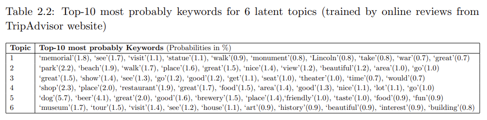

# Latent Dirichlet Allocation
## About LDA
Latent Dirichlet Allocation (LDA) is a generative statistical model used for topic modeling. It assumes that documents are mixtures of topics and that topics are mixtures of words. Each document is represented as a distribution over topics, and each topic is represented as a distribution over words.

**Why it's useful:**
LDA helps in uncovering hidden thematic structures within large sets of text data, making it easier to summarize and understand the content.

**Application to location reviews:**
When applied to reviews of locations, LDA can identify groups of related words (topics) based on the words used in the reviews. Since LDA is an unsupervised method, it does not require predefined labels for these topics. Instead, we infer the topics ourselves by interpreting the most prominent words in each group. For example, if reviews of a location frequently mention words like "food", "service", and "dining", we might infer that the topic is related to a restaurant. This aids in categorizing and understanding locations based on user feedback. More information about this process can be found in [*Fine-Grained Diversification of Proximity Constrained Queries on Road Networks*](https://dl.acm.org/doi/10.1145/3340964.3340970).

## Our Pretrained Model
Our model was trained on a large corpus of TripAdvisor Reviews from cities across the United States. Additional information about our pretrained model can be found on pages 10-13 of [*Semantically diverse and spatially constrained queries*](https://dr.lib.iastate.edu/entities/publication/1e5f5fa0-917b-40dd-ba77-980a8adfb068). The highest probability keywords for each topic are given in the table below. Based on these, one can infer that topic 1 is related to memorials, topic 2 is related to parks and beaches, topic 3 is related to theaters and shows, topic 4 is related to shops and restaurants, topic 5 is related to breweries, and topic 6 is related to museums.

